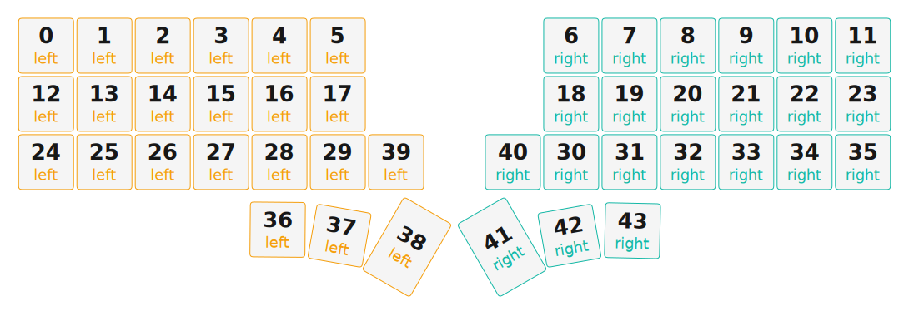

# ZMK Configuration for miiUnic

*Generated by Shield Wizard for ZMK*



Download compiled firmware from the Actions tab. <https://zmk.dev/docs/user-setup#installing-the-firmware>

Edit your keymap <https://zmk.dev/docs/keymaps>.
User keymap is located at [`config/miiunic.keymap`](config/miiunic.keymap).

-----

<details>
<summary>
Shield Wizard Debug Information
</summary>

In case of broken configuration, here is the Shield Wizard internal data used to generate this configuration:

Commit: 8a52249f61161469b6d90ed8c80c4aa52b9f3858

```json
{"name":"miiUnic","shield":"miiunic","dongle":false,"modules":[],"layout":[{"id":"01KJNQ6YNWVH4JTBD76E552NDF","part":0,"row":0,"col":1,"w":1,"h":1,"x":1,"y":0,"r":0,"rx":0,"ry":0},{"id":"01KJNQ6YWPZGDJ4M93T35JJWDG","part":0,"row":0,"col":2,"w":1,"h":1,"x":2,"y":0,"r":0,"rx":0,"ry":0},{"id":"01KJNQ6Z31XWZRTHTSQ8CVXF4V","part":0,"row":0,"col":3,"w":1,"h":1,"x":3,"y":0,"r":0,"rx":0,"ry":0},{"id":"01KJNQ6ZDQPXC86T2F96MGZ60B","part":0,"row":0,"col":4,"w":1,"h":1,"x":4,"y":0,"r":0,"rx":0,"ry":0},{"id":"01KJNQ6ZN4CNT38ECDFYAS99VH","part":0,"row":0,"col":5,"w":1,"h":1,"x":5,"y":0,"r":0,"rx":0,"ry":0},{"id":"01KJNQ6ZW396M68TAMK6PRNAJN","part":0,"row":0,"col":6,"w":1,"h":1,"x":6,"y":0,"r":0,"rx":0,"ry":0},{"id":"01KJNR8DS2A1KPD1XVTNS2MBBA","part":1,"row":0,"col":9,"w":1,"h":1,"x":10,"y":0,"r":0,"rx":0,"ry":0},{"id":"01KJNR8E60E2PBE03DGE9RBF8B","part":1,"row":0,"col":10,"w":1,"h":1,"x":11,"y":0,"r":0,"rx":0,"ry":0},{"id":"01KJNR8EHEPWP6HBCZXMKE3W2Q","part":1,"row":0,"col":11,"w":1,"h":1,"x":12,"y":0,"r":0,"rx":0,"ry":0},{"id":"01KJNR8F285MBZDYXH3QQKTD9J","part":1,"row":0,"col":12,"w":1,"h":1,"x":13,"y":0,"r":0,"rx":0,"ry":0},{"id":"01KJNR8FD18P0763757XJEK386","part":1,"row":0,"col":13,"w":1,"h":1,"x":14,"y":0,"r":0,"rx":0,"ry":0},{"id":"01KJNR8FQ0NEJM2JM477N67HND","part":1,"row":0,"col":14,"w":1,"h":1,"x":15,"y":0,"r":0,"rx":0,"ry":0},{"id":"01KJNQ73N8EEG3MXBWCD1KK0XK","part":0,"row":1,"col":1,"w":1,"h":1,"x":1,"y":1,"r":0,"rx":0,"ry":0},{"id":"01KJNQ73X179HCV2BB0052BDPD","part":0,"row":1,"col":2,"w":1,"h":1,"x":2,"y":1,"r":0,"rx":0,"ry":0},{"id":"01KJNQ745Y32AYV4K7MS4Z4QWB","part":0,"row":1,"col":3,"w":1,"h":1,"x":3,"y":1,"r":0,"rx":0,"ry":0},{"id":"01KJNQ74GJ05MGAJ11VKZQ2510","part":0,"row":1,"col":4,"w":1,"h":1,"x":4,"y":1,"r":0,"rx":0,"ry":0},{"id":"01KJNQ74QMPTWR0AXD68QK77V8","part":0,"row":1,"col":5,"w":1,"h":1,"x":5,"y":1,"r":0,"rx":0,"ry":0},{"id":"01KJNQ74Y9HBJZ0FCDFJV25VXD","part":0,"row":1,"col":6,"w":1,"h":1,"x":6,"y":1,"r":0,"rx":0,"ry":0},{"id":"01KJNRD48NPZ5EGSMYT9VT4FPD","part":1,"row":1,"col":9,"w":1,"h":1,"x":10,"y":1,"r":0,"rx":0,"ry":0},{"id":"01KJNRD51F9QDZ254YVSXKH211","part":1,"row":1,"col":10,"w":1,"h":1,"x":11,"y":1,"r":0,"rx":0,"ry":0},{"id":"01KJNRD5NKHNKQ1QCEAFE8SE2Q","part":1,"row":1,"col":11,"w":1,"h":1,"x":12,"y":1,"r":0,"rx":0,"ry":0},{"id":"01KJNRD69SR5KBR3WK08X3AY2J","part":1,"row":1,"col":12,"w":1,"h":1,"x":13,"y":1,"r":0,"rx":0,"ry":0},{"id":"01KJNRD6Z2QR7C3T7BF9YHJ35Y","part":1,"row":1,"col":13,"w":1,"h":1,"x":14,"y":1,"r":0,"rx":0,"ry":0},{"id":"01KJNRD7P18R7601J04CEMYMZG","part":1,"row":1,"col":14,"w":1,"h":1,"x":15,"y":1,"r":0,"rx":0,"ry":0},{"id":"01KJNQ8NC52SPS29G17YGG3NTV","part":0,"row":2,"col":1,"w":1,"h":1,"x":1,"y":2,"r":0,"rx":0,"ry":0},{"id":"01KJNQ8NMMVPJQSV4KZ69XHBD3","part":0,"row":2,"col":2,"w":1,"h":1,"x":2,"y":2,"r":0,"rx":0,"ry":0},{"id":"01KJNQ8NX89WECQMCE74YG960R","part":0,"row":2,"col":3,"w":1,"h":1,"x":3,"y":2,"r":0,"rx":0,"ry":0},{"id":"01KJNQ8P98MFKVT76HPQKSG0JJ","part":0,"row":2,"col":4,"w":1,"h":1,"x":4,"y":2,"r":0,"rx":0,"ry":0},{"id":"01KJNQ8PHN4C0D13JP10PKX2TF","part":0,"row":2,"col":5,"w":1,"h":1,"x":5,"y":2,"r":0,"rx":0,"ry":0},{"id":"01KJNQ8PVK5M4GWB0TCPWW2KAB","part":0,"row":2,"col":6,"w":1,"h":1,"x":6,"y":2,"r":0,"rx":0,"ry":0},{"id":"01KJNRFQWRSS6KBRNCM6D0H0WF","part":1,"row":2,"col":9,"w":1,"h":1,"x":10,"y":2,"r":0,"rx":0,"ry":0},{"id":"01KJNRFR996VY848Y8164R7BZG","part":1,"row":2,"col":10,"w":1,"h":1,"x":11,"y":2,"r":0,"rx":0,"ry":0},{"id":"01KJNRFRPQYN10GR4VQT2BF6SP","part":1,"row":2,"col":11,"w":1,"h":1,"x":12,"y":2,"r":0,"rx":0,"ry":0},{"id":"01KJNRFS597JVB614VDZ659FPX","part":1,"row":2,"col":12,"w":1,"h":1,"x":13,"y":2,"r":0,"rx":0,"ry":0},{"id":"01KJNRFSKWYA2Y59BF5THAM478","part":1,"row":2,"col":13,"w":1,"h":1,"x":14,"y":2,"r":0,"rx":0,"ry":0},{"id":"01KJNRFT0N61JH65XKS599JKZ3","part":1,"row":2,"col":14,"w":1,"h":1,"x":15,"y":2,"r":0,"rx":0,"ry":0},{"id":"01KJNQ9VG5FHDDB3JWTZ1H7WTA","part":0,"row":3,"col":4,"w":1,"h":1,"x":5,"y":3,"r":0.5,"rx":-13,"ry":0},{"id":"01KJNQ9VXAN92997P1JG2M2XQ4","part":0,"row":3,"col":5,"w":1,"h":1,"x":6,"y":3,"r":10,"rx":5,"ry":3.8},{"id":"01KJNQ9WCCSHV9CMXWM3RWK4PG","part":0,"row":3,"col":6,"w":1,"h":1.5,"x":7,"y":3,"r":30,"rx":7.2,"ry":4.2},{"id":"01KJNQ9WYKCJ0D9B9BZRG71YD2","part":0,"row":3,"col":7,"w":1,"h":1,"x":7,"y":2,"r":0,"rx":0,"ry":0},{"id":"01KJNS4S25QDACBV3CE6JXY1QH","part":1,"row":3,"col":8,"w":1,"h":1,"x":9,"y":2,"r":0,"rx":0,"ry":0},{"id":"01KJNRHPAS5N9EHDZCFM9TJRNA","part":1,"row":3,"col":9,"w":1,"h":1.5,"x":9,"y":3,"r":-30,"rx":9.8,"ry":4.2},{"id":"01KJNRHPY5TVMVXQPADZEX00C6","part":1,"row":3,"col":10,"w":1,"h":1,"x":10,"y":3,"r":-10,"rx":12,"ry":3.8},{"id":"01KJNRHQK9SKCQAQJT1RTKD52M","part":1,"row":3,"col":11,"w":1,"h":1,"x":11,"y":3,"r":1.2,"rx":3,"ry":6}],"parts":[{"name":"left","controller":"nice_nano_v2","wiring":"matrix_diode","keys":{"01KJNQ6YNWVH4JTBD76E552NDF":{"output":"d21","input":"d5"},"01KJNQ73N8EEG3MXBWCD1KK0XK":{"output":"d21","input":"d6"},"01KJNQ8NC52SPS29G17YGG3NTV":{"output":"d21","input":"d7"},"01KJNQ6YWPZGDJ4M93T35JJWDG":{"output":"d20","input":"d5"},"01KJNQ73X179HCV2BB0052BDPD":{"output":"d20","input":"d6"},"01KJNQ8NMMVPJQSV4KZ69XHBD3":{"output":"d20","input":"d7"},"01KJNQ6Z31XWZRTHTSQ8CVXF4V":{"output":"d19","input":"d5"},"01KJNQ745Y32AYV4K7MS4Z4QWB":{"output":"d19","input":"d6"},"01KJNQ8NX89WECQMCE74YG960R":{"output":"d19","input":"d7"},"01KJNQ6ZDQPXC86T2F96MGZ60B":{"output":"d18","input":"d5"},"01KJNQ74GJ05MGAJ11VKZQ2510":{"output":"d18","input":"d6"},"01KJNQ8P98MFKVT76HPQKSG0JJ":{"output":"d18","input":"d7"},"01KJNQ9VG5FHDDB3JWTZ1H7WTA":{"output":"d18","input":"d8"},"01KJNQ6ZN4CNT38ECDFYAS99VH":{"output":"d15","input":"d5"},"01KJNQ74QMPTWR0AXD68QK77V8":{"output":"d15","input":"d6"},"01KJNQ8PHN4C0D13JP10PKX2TF":{"output":"d15","input":"d7"},"01KJNQ9VXAN92997P1JG2M2XQ4":{"output":"d15","input":"d8"},"01KJNQ6ZW396M68TAMK6PRNAJN":{"output":"d14","input":"d5"},"01KJNQ74Y9HBJZ0FCDFJV25VXD":{"output":"d14","input":"d6"},"01KJNQ8PVK5M4GWB0TCPWW2KAB":{"output":"d14","input":"d7"},"01KJNQ9WCCSHV9CMXWM3RWK4PG":{"output":"d14","input":"d8"},"01KJNQ9WYKCJ0D9B9BZRG71YD2":{"output":"d16","input":"d8"}},"encoders":[{"pinA":"d9","pinB":"d10"}],"pins":{"d10":"encoder","d9":"encoder","d4":"bus","d3":"bus","d2":"bus","d21":"output","d20":"output","d19":"output","d18":"output","d15":"output","d14":"output","d16":"output","d5":"input","d6":"input","d7":"input","d8":"input"},"buses":[{"type":"spi","name":"spi0","devices":[{"type":"niceview","cs":"d4"}],"sck":"d3","mosi":"d2"},{"type":"spi","name":"spi1","devices":[]},{"type":"spi","name":"spi2","devices":[]},{"type":"spi","name":"spi3","devices":[]},{"type":"i2c","name":"i2c0","devices":[]},{"type":"i2c","name":"i2c1","devices":[]}]},{"name":"right","controller":"nice_nano_v2","wiring":"matrix_diode","keys":{"01KJNR8FQ0NEJM2JM477N67HND":{"output":"d21","input":"d5"},"01KJNRD7P18R7601J04CEMYMZG":{"output":"d21","input":"d6"},"01KJNRFT0N61JH65XKS599JKZ3":{"output":"d21","input":"d7"},"01KJNR8FD18P0763757XJEK386":{"output":"d20","input":"d5"},"01KJNRD6Z2QR7C3T7BF9YHJ35Y":{"output":"d20","input":"d6"},"01KJNRFSKWYA2Y59BF5THAM478":{"output":"d20","input":"d7"},"01KJNR8F285MBZDYXH3QQKTD9J":{"output":"d19","input":"d5"},"01KJNRD69SR5KBR3WK08X3AY2J":{"output":"d19","input":"d6"},"01KJNRFS597JVB614VDZ659FPX":{"output":"d19","input":"d7"},"01KJNR8EHEPWP6HBCZXMKE3W2Q":{"output":"d18","input":"d5"},"01KJNRD5NKHNKQ1QCEAFE8SE2Q":{"output":"d18","input":"d6"},"01KJNRFRPQYN10GR4VQT2BF6SP":{"output":"d18","input":"d7"},"01KJNRHQK9SKCQAQJT1RTKD52M":{"output":"d18","input":"d8"},"01KJNR8E60E2PBE03DGE9RBF8B":{"output":"d15","input":"d5"},"01KJNRD51F9QDZ254YVSXKH211":{"output":"d15","input":"d6"},"01KJNRFR996VY848Y8164R7BZG":{"output":"d15","input":"d7"},"01KJNRHPY5TVMVXQPADZEX00C6":{"output":"d15","input":"d8"},"01KJNR8DS2A1KPD1XVTNS2MBBA":{"output":"d14","input":"d5"},"01KJNRD48NPZ5EGSMYT9VT4FPD":{"output":"d14","input":"d6"},"01KJNRFQWRSS6KBRNCM6D0H0WF":{"output":"d14","input":"d7"},"01KJNRHPAS5N9EHDZCFM9TJRNA":{"output":"d14","input":"d8"},"01KJNS4S25QDACBV3CE6JXY1QH":{"output":"d16","input":"d8"}},"encoders":[{"pinA":"d9","pinB":"d10"}],"pins":{"d21":"output","d20":"output","d19":"output","d18":"output","d15":"output","d14":"output","d16":"output","d9":"encoder","d10":"encoder","d8":"input","d7":"input","d6":"input","d5":"input"},"buses":[{"type":"spi","name":"spi0","devices":[]},{"type":"spi","name":"spi1","devices":[]},{"type":"spi","name":"spi2","devices":[]},{"type":"spi","name":"spi3","devices":[]},{"type":"i2c","name":"i2c0","devices":[]},{"type":"i2c","name":"i2c1","devices":[]}]}]}
```

</details>
